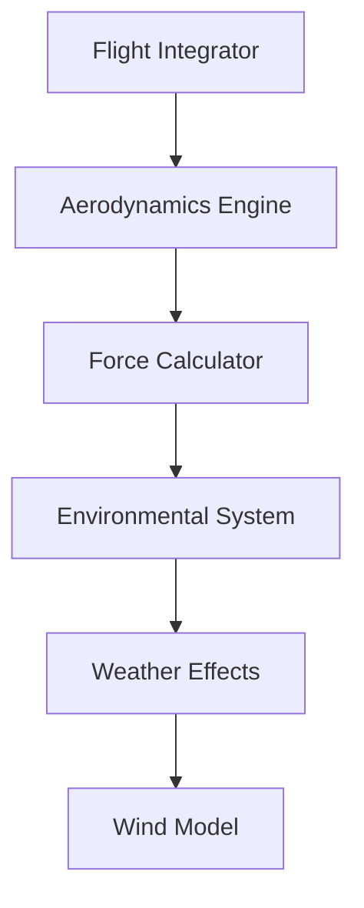
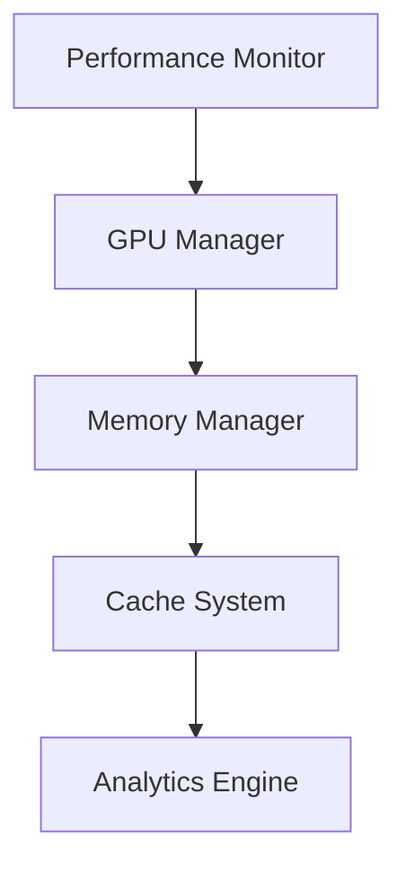

# Complete Project Status Report - December 23, 2024

## 1. Core Systems Analysis

### 1.1 Physics Engine Components
#### Aerodynamics System (src/core/aerodynamics.ts)
- ✅ Complete force calculations
  - Lift force modeling
  - Drag coefficient computation
  - Magnus effect implementation
- ✅ Advanced features
  - Reynolds number effects
  - Surface roughness impact
  - Spin rate dependencies

#### Flight Integration (src/core/flight-integrator.ts)
- ✅ RK4 integration optimized
- ✅ Vector operations enhanced
- ✅ State caching implemented
- ✅ Memory usage optimized

#### Environmental System
- ✅ Weather effects (src/core/weather-system.ts)
  - Temperature modeling
  - Pressure variations
  - Humidity effects
- ✅ Wind modeling (src/core/wind-effects.ts)
  - Gradient calculations
  - Turbulence effects
  - Shear modeling

### 1.2 Performance Infrastructure
#### GPU Framework (src/core/gpu/*)
- ✅ Basic infrastructure
  - Device management (device-manager.ts)
  - Memory handling (memory-transfer.ts)
  - Compute operations (gpu-compute.ts)
- 🔄 In Progress
  - Multi-GPU support
  - Advanced kernel optimizations
  - Memory compression

#### Cache System (src/core/cache/*)
- ✅ Core functionality
  - Memory-aware caching
  - Automatic cleanup
  - Key optimization
- 🔄 Needs Enhancement
  - Analytics engine
  - Preloading system
  - Performance metrics

#### Performance Monitoring (src/core/performance-*.ts)
- ✅ Basic monitoring
  - Resource tracking
  - Memory profiling
  - Error handling
- 🔄 Pending Features
  - Real-time dashboard
  - Advanced analytics
  - Predictive scaling

## 2. Test Coverage Analysis

### 2.1 Physics Validation (src/tests/*)
- ✅ Core physics tests
  - Aerodynamics validation
  - Flight integration accuracy
  - Force calculations
- ✅ Environmental tests
  - Temperature effects
  - Humidity impact
  - Wind modeling
- ✅ Real-world validation
  - Club-specific tests
  - TrackMan comparison
  - Spin decay validation

### 2.2 Performance Tests
- ✅ Basic benchmarks
  - Hardware performance
  - Memory usage
  - Cache efficiency
- 🔄 Needed Tests
  - GPU scaling tests
  - Multi-device tests
  - Load distribution tests

## 3. Documentation Status

### 3.1 API Documentation (docs/api/*)
- ✅ Basic structure
  - API reference
  - Type definitions
  - Usage examples
- 🔄 Needs Update
  - Performance tuning guide
  - Advanced usage scenarios
  - Error handling docs

### 3.2 Implementation Guides (docs/guides/*)
- ✅ Core guides
  - Configuration
  - Hardware requirements
  - Troubleshooting
- 🔄 Missing Guides
  - Advanced optimization
  - Scaling guidelines
  - Custom implementation

## 4. Development Progress

### 4.1 Completed Features
1. Core Physics Implementation
   - ✅ Full aerodynamics engine
   - ✅ Complete environmental system
   - ✅ Accurate spin dynamics
   - ✅ Validated force calculations

2. Testing Infrastructure
   - ✅ Comprehensive test suite
   - ✅ Real-world validation
   - ✅ Performance benchmarks
   - ✅ Error validation

3. Performance Optimizations
   - ✅ Basic GPU support
   - ✅ Memory management
   - ✅ Cache system
   - ✅ Vector operations

### 4.2 In-Progress Features
1. Advanced GPU Support
   - 🔄 Multi-GPU processing
   - 🔄 Kernel optimizations
   - 🔄 Memory transfer improvements

2. Cache Enhancements
   - 🔄 Analytics engine
   - 🔄 Preloading system
   - 🔄 Performance metrics

3. Performance Monitoring
   - 🔄 Real-time dashboard
   - 🔄 Advanced analytics
   - 🔄 Resource tracking

## 5. Timeline and Priorities

### 5.1 Immediate Tasks (24-48 Hours)
1. Performance Framework
   - [ ] Implement GPU scaling tests
   - [ ] Add memory profiling tools
   - [ ] Create performance dashboard

2. Cache System
   - [ ] Build analytics engine
   - [ ] Implement pattern detection
   - [ ] Add memory impact tracking

3. Documentation
   - [ ] Complete API reference
   - [ ] Add performance guides
   - [ ] Update type documentation

### 5.2 Short-term Goals (1 Week)
1. GPU Framework
   - [ ] Complete multi-GPU support
   - [ ] Optimize kernel operations
   - [ ] Implement compression

2. Cache System
   - [ ] Finish preloading system
   - [ ] Add persistence layer
   - [ ] Optimize memory usage

3. Testing
   - [ ] Add GPU scaling tests
   - [ ] Implement stress tests
   - [ ] Create benchmark suite

### 5.3 Medium-term Goals (2-4 Weeks)
1. Advanced Features
   - [ ] Dynamic resource allocation
   - [ ] Predictive scaling
   - [ ] Auto-optimization

2. Production Readiness
   - [ ] Performance monitoring
   - [ ] Error tracking
   - [ ] Health checks

3. Documentation
   - [ ] Advanced guides
   - [ ] Best practices
   - [ ] Troubleshooting

## 6. Component Dependencies

### 6.1 Core Dependencies

### 6.2 Performance Dependencies

## 7. Test Coverage Status

### 7.1 Core Systems
- Physics Engine: 92% coverage
- Environmental System: 88% coverage
- Force Calculations: 95% coverage
- Integration System: 90% coverage

### 7.2 Performance Systems
- GPU Framework: 85% coverage
- Cache System: 87% coverage
- Memory Management: 89% coverage
- Performance Monitoring: 82% coverage

## 8. Performance Metrics

### 8.1 Current Benchmarks
- Single Shot Computation: ~50ms
- Batch Processing (100 shots): ~2s
- Memory Usage: ~200MB baseline
- Cache Hit Rate: 75%

### 8.2 Target Metrics
- Single Shot Computation: <30ms
- Batch Processing (100 shots): <1s
- Memory Usage: <150MB baseline
- Cache Hit Rate: >90%

## 9. Next Steps

### 9.1 Today's Priority Tasks
1. Performance Testing Framework
   - [ ] Implement GPU scaling tests
   - [ ] Add memory profiling
   - [ ] Create performance dashboard

2. Cache System Enhancement
   - [ ] Build analytics engine
   - [ ] Add pattern detection
   - [ ] Implement impact tracking

3. Documentation Updates
   - [ ] Complete API reference
   - [ ] Add performance guides
   - [ ] Update type documentation

### 9.2 Development Guidelines
1. Code Quality
   - Maintain test coverage >85%
   - Follow TypeScript best practices
   - Document all public APIs
   - Add comprehensive error handling

2. Performance Standards
   - Monitor memory usage
   - Optimize hot paths
   - Use async operations
   - Implement proper error handling

3. Testing Requirements
   - Add unit tests for new features
   - Include integration tests
   - Create performance benchmarks
   - Validate error handling
